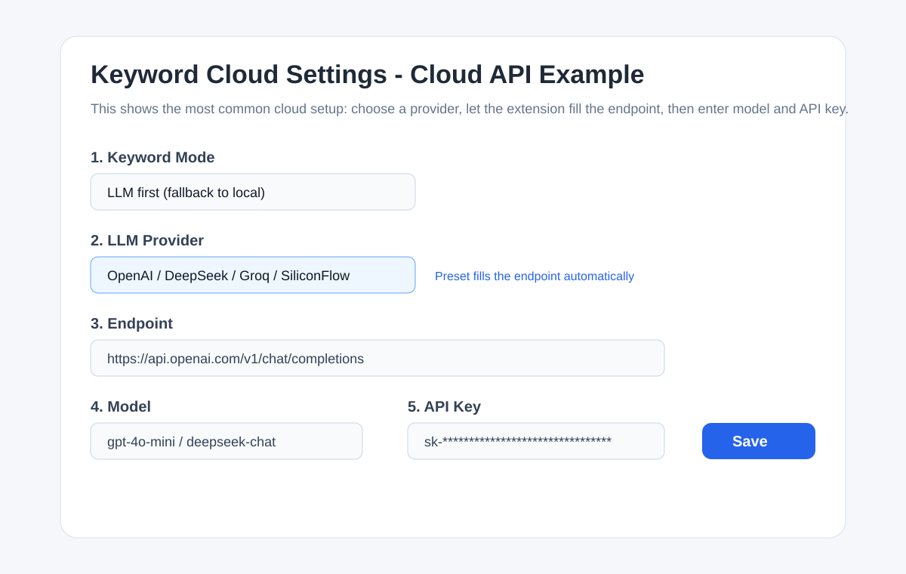
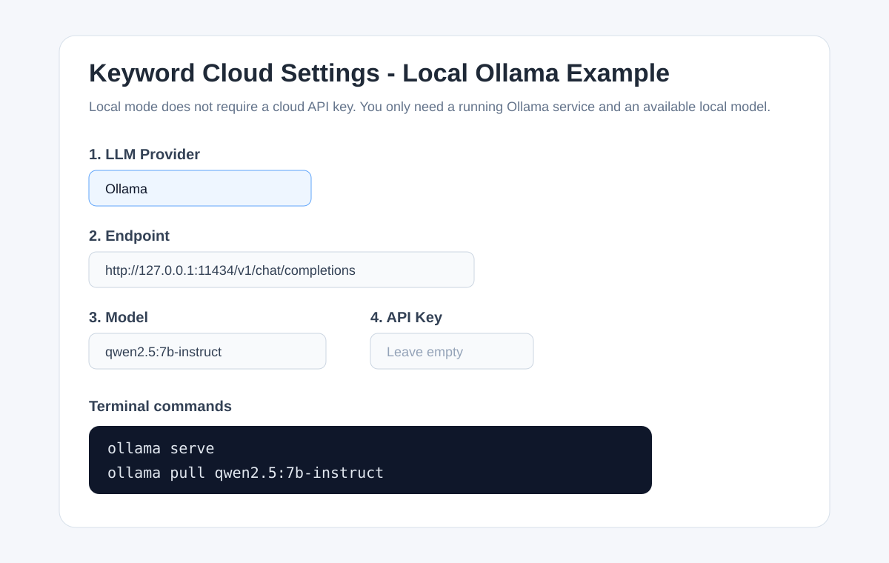

# SearchBoundary (Search Border) Extension (Chrome MV3)

This extension adds a keyword cloud panel to the right side of Google, Bing, and Baidu search result pages. It fetches search result pages, reads article content or title/snippet text, extracts weighted keywords, and renders them as a cloud.

Core intent: even in today's AI search era (including RAG-enhanced assistants), traditional search can still hide boundary points that are easy to miss. SearchBoundary is built to help users push outward and touch the boundary of what they are actually trying to find.

## Feature Summary

- Supported engines: Google, Bing (global and CN), Baidu
- Two runtime paths:
  - Cloud API call
  - Local model call with Ollama
- Configurable options:
  - Panel language
  - Search pages to fetch: `1 / 5 / 10`
  - Keywords per document: `5 / 10`
  - Final keyword cap: default `40`
- Word cloud rendering: built-in flow layout (no remote CDN dependency)
- Clickable keywords open the related result page in a new tab

## Popup/Sidebar Preview


## Install the Extension

1. Open Chrome and go to `chrome://extensions`
2. Enable `Developer mode`
3. Click `Load unpacked`
4. Select `/Users/mai/dailycode/searchboundary` (if you have not renamed the folder yet, use the current folder first, then switch to the new one after rename)
5. Open the extension `Options` page from the extension card

## Basic Settings

The `Panel Language` option only changes the extension UI text. It does not force the extracted keywords into that language.

### Common settings

- `Keyword Mode`
  - `LLM first (fallback to local)` uses cloud APIs or local Ollama first
  - `Local only` skips model calls and uses the local extraction algorithm only
- `Panel Language`
  - Controls the sidebar UI labels, buttons, and status text
  - Also changes the language of the settings page itself
- `Search pages to fetch`
  - Current choices: `1 / 5 / 10`
- `Keywords per document`
  - Current choices: `5 / 10`
- `Keyword limit`
  - Maximum number of keywords shown in the final cloud

## Cloud API Setup

Use this when you already have an API key from OpenAI, DeepSeek, Groq, SiliconFlow, OpenRouter, or another supported provider.

### Setup steps

1. Open the extension options page
2. Set `Keyword Mode` to `LLM first (fallback to local)`
3. Choose your provider in `LLM Provider`
4. Check `Endpoint`
   - For built-in providers, the extension auto-fills the default endpoint
   - Only edit it if you use a private gateway, proxy, or compatible relay
5. Enter the model name in `Model`
6. Paste your API key into `API Key`
7. Click `Save Settings`
8. Refresh the search results page

### Cloud setup screenshot



### Common examples

- OpenAI
  - Provider: `OpenAI`
  - Endpoint: auto-filled
  - Model: `gpt-4o-mini`
  - API Key: your `sk-...`
- DeepSeek
  - Provider: `DeepSeek`
  - Endpoint: auto-filled
  - Model: `deepseek-chat`
  - API Key: your DeepSeek key
- SiliconFlow
  - Provider: `SiliconFlow`
  - Endpoint: auto-filled
  - Model: use any model name available in your SiliconFlow account
  - API Key: your SiliconFlow key

### Do I still need to fill endpoint after entering an API key?

Usually no.

You only need to manually edit `Endpoint` when:

1. You use a private proxy
2. You use a custom API gateway
3. You use an OpenAI-compatible relay with a non-default URL

## Local Setup with Ollama

Use this when you want local inference and do not want to rely on a cloud API.

### Local preparation

Make sure Ollama is installed and running on your machine.

Typical commands:

```bash
ollama serve
ollama pull qwen2.5:7b-instruct
```

You can also use another model, for example:

```bash
ollama pull deepseek-r1:1.5b
```

### Setup steps

1. Open the extension options page
2. Set `Keyword Mode` to `LLM first (fallback to local)`
3. Set `LLM Provider` to `Ollama`
4. Confirm `Endpoint` is:

```text
http://127.0.0.1:11434/v1/chat/completions
```

5. Enter the exact local model name in `Model`
6. Leave `API Key` empty
7. Click `Save Settings`
8. Refresh the search results page

### Local setup screenshot



## Reading the Status Line

At the bottom of the sidebar, you will see:

- `Call: Cloud API` or `Call: Local`
- `Docs X/Y`
  - `X` is the number of documents actually used
  - `Y` is the number of documents attempted
- `Elapsed 1.23s`
  - Total time from analysis start to cloud render

## Troubleshooting

### 1. I changed settings but the page did not update

Try these in order:

1. Refresh the search page
2. If nothing changes, open `chrome://extensions` and click `Reload` on the extension

### 2. My local model is not working

Check these:

1. `ollama serve` is running
2. The `Model` value exactly matches the name shown by `ollama list`
3. `Endpoint` is still `http://127.0.0.1:11434/v1/chat/completions`

### 3. I filled the cloud API key. Why is endpoint still here?

The field stays visible because some users need to override it. For most preset providers, you can simply leave the auto-filled endpoint as-is.

## Publishing Notes

- Chrome Web Store checklist: [docs/CHROME_WEBSTORE_PREP.md](./docs/CHROME_WEBSTORE_PREP.md)
- Privacy notes: [docs/PRIVACY.md](./docs/PRIVACY.md)

## Project Structure

- `manifest.json`: extension manifest
- `src/content.js`: sidebar injection, rendering, front-end interactions
- `src/background.js`: fetch, parse, and extraction pipeline
- `src/parser/index.js`: parsers for Google / Bing / Baidu
- `src/keywords/extract.js`: local keyword extraction
- `src/keywords/llm.js`: LLM calling and provider adaptation
- `src/options/`: settings page
- `src/shared/providers.js`: provider presets
