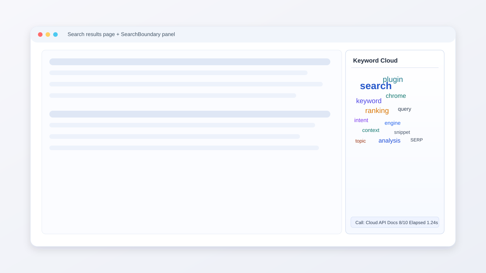
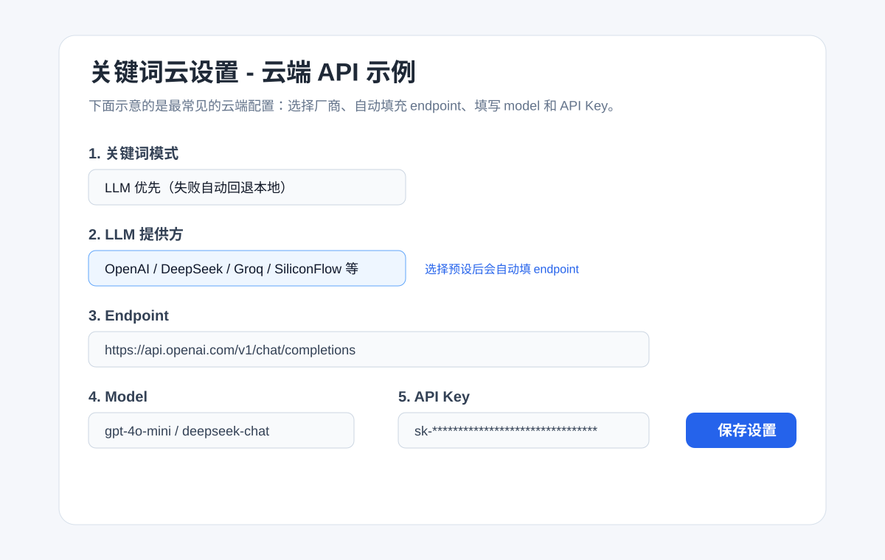
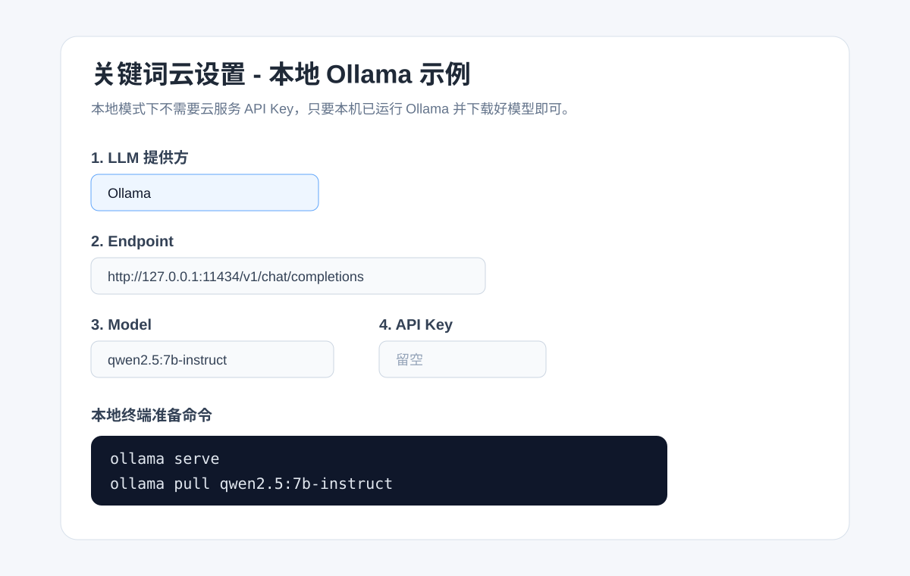

# SearchBoundary（搜索边界）插件（Chrome MV3）

这是一个运行在 Google、Bing、百度搜索页右侧的关键词云插件。它会抓取你设置页数内的搜索结果，提取文章正文或标题摘要中的关键词，并用词云方式展示出来。

核心定位：即使在当下有 RAG 加持的 AI 搜索环境里，传统搜索结果中仍可能存在我们尚未察觉、但值得继续延伸探查的关键点。SearchBoundary 想做的，就是尽力帮助用户触摸到“所求内容的边界”。

## 功能概览

- 支持搜索引擎：Google、Bing（国际版/国内版）、百度
- 支持两种调用方式：
  - 云端 API 调用
  - 本地模型调用（Ollama）
- 设置项可配置：
  - 面板语言
  - 抓取页数：`1 / 5 / 10`
  - 单篇文章关键词数：`5 / 10`
  - 关键词总上限：默认 `40`
- 词云渲染：内置流式布局（不依赖远程 CDN 脚本）
- 点击关键词可在新标签页打开对应结果链接

## 弹窗/侧栏界面展示图



## 安装插件

1. 打开 Chrome，进入 `chrome://extensions`
2. 右上角开启“开发者模式”
3. 点击“加载已解压的扩展程序”
4. 选择目录：`/Users/mai/dailycode/searchboundary`（若你还没改目录名，先用当前目录，改名后再用新目录）
5. 加载完成后，点击插件卡片中的“扩展程序选项”进入设置页

## 基础设置说明

设置页中的“面板语言”只影响插件界面文案，不会强制改变提取出来的关键词语种。

### 通用设置项

- `关键词模式`
  - `LLM 优先（失败自动回退本地）`：优先调用云端 API 或本地 Ollama
  - `仅本地算法`：不调用模型，只用本地关键词算法
- `面板语言`
  - 控制弹窗标题、按钮、状态文案
  - 也会同步切换“面板设置”页面本身的语言
- `抓取页数`
  - 目前可选 `1 / 5 / 10`
- `单篇文章关键词数量`
  - 目前可选 `5 / 10`
- `关键词上限`
  - 控制最终词云最多显示多少个词

## 云端 API 调用配置

适合你已经有 OpenAI、DeepSeek、Groq、SiliconFlow、OpenRouter 等 API Key 的情况。

### 配置步骤

1. 打开插件设置页
2. 将 `关键词模式` 设为 `LLM 优先（失败自动回退本地）`
3. 在 `LLM 提供方` 中选择你的服务商
4. 查看 `Endpoint`
   - 选择预设厂商后，插件会自动填入默认 endpoint
   - 如果你使用私有代理、网关或 OpenAI 兼容转发服务，再手动改 endpoint
5. 在 `Model` 中填写模型名
6. 在 `API Key` 中填写密钥
7. 点击 `保存设置`
8. 回到搜索结果页，刷新页面

### 云端配置示意图



### 常见填写示例

- OpenAI
  - Provider：`OpenAI`
  - Endpoint：自动填充
  - Model：`gpt-4o-mini`
  - API Key：你的 `sk-...`
- DeepSeek
  - Provider：`DeepSeek`
  - Endpoint：自动填充
  - Model：`deepseek-chat`
  - API Key：你的 DeepSeek Key
- SiliconFlow
  - Provider：`SiliconFlow`
  - Endpoint：自动填充
  - Model：使用你在 SiliconFlow 控制台可调用的模型名
  - API Key：你的 SiliconFlow Key

### 关于 endpoint

- 选择预设厂商时：通常不需要自己填写 endpoint
- 使用自建服务、代理网关、统一转发层时：需要手动填写 endpoint

## 本地调用配置（Ollama）

适合你不想使用云端 API，或者希望在本机完成调用。

### 本地准备

先确保本机已经安装 Ollama，并且 Ollama 服务能正常启动。

常见命令如下：

```bash
ollama serve
ollama pull qwen2.5:7b-instruct
```

如果你要用别的模型，也可以替换成你自己的模型名，例如：

```bash
ollama pull deepseek-r1:1.5b
```

### 配置步骤

1. 打开插件设置页
2. 将 `关键词模式` 设为 `LLM 优先（失败自动回退本地）`
3. 将 `LLM 提供方` 设为 `Ollama`
4. 确认 `Endpoint` 为：

```text
http://127.0.0.1:11434/v1/chat/completions
```

5. 在 `Model` 里填写你本机已经下载的模型名
6. `API Key` 留空
7. 点击 `保存设置`
8. 回到搜索结果页，刷新页面

### 本地配置示意图



## 运行结果怎么看

插件右侧弹窗底部会显示：

- `调用：云端API` 或 `调用：本地`
- `正文 X/Y`
  - `X`：实际成功用于提取的正文数
  - `Y`：尝试抓取的正文数
- `耗时 1.23s`
  - 从当前页面启动分析到词云渲染完成的总耗时

## 常见问题

### 1. 为什么改了设置后页面没有变化？

先做这两步：

1. 回搜索页面刷新
2. 如果还是没变化，去 `chrome://extensions` 点击该扩展的“重新加载”

### 2. 本地模型不生效怎么办？

检查这几项：

1. `ollama serve` 是否已启动
2. `Model` 是否和 `ollama list` 中显示的名字完全一致
3. `Endpoint` 是否仍是 `http://127.0.0.1:11434/v1/chat/completions`

### 3. 云端 API 已填好，还需要自己写 endpoint 吗？

大多数情况下不需要。只有在下面场景需要手动写：

1. 你使用自建代理
2. 你使用统一 API 网关
3. 你使用 OpenAI 兼容接口，但默认地址不是官方地址

## 发布准备说明

- Chrome 应用商店上架清单：[docs/CHROME_WEBSTORE_PREP.md](./docs/CHROME_WEBSTORE_PREP.md)
- 隐私说明参考：[docs/PRIVACY.md](./docs/PRIVACY.md)

## 主要目录

- `manifest.json`：插件清单
- `src/content.js`：侧栏注入、词云渲染、前端交互
- `src/background.js`：抓取、解析、关键词提取主流程
- `src/parser/index.js`：Google / Bing / 百度解析器
- `src/keywords/extract.js`：本地关键词提取
- `src/keywords/llm.js`：LLM 调用与厂商适配
- `src/options/`：设置页
- `src/shared/providers.js`：厂商预设
